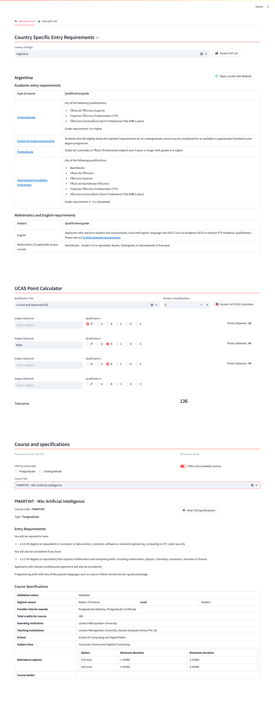
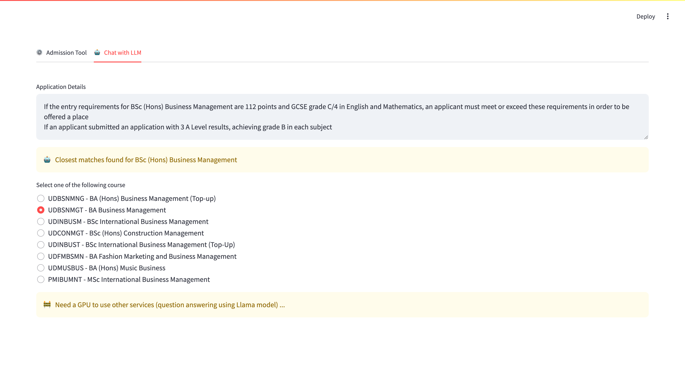

# Application Clearing Assistant Tool

<small>for London Metropolitan University</small>

<br/>


<div style="text-align: justify">
I came across a job at my university that involved processing the applications of students who had applied for courses. The job entailed reviewing the applications to verify if the students possessed the necessary qualifications for the courses they applied for. This included checking the students' grades, their previous qualifications, their personal statements, and so on. To accomplish this, the job description required the person to review the course requirements on the university website and then assess the applications to ensure the students met these qualifications.</div><br/>

This was a very tedious and time consuming job and i thought to myself "Why not make this process easier and faster?"
<br/>

<div align=center>
 
</div>

<br/>

## Features

- Scrap the information from the university website
- One click to get the following information:
  - Course requirements
  - UCAS points for the students
  - Qualifications required for international students (if available)

<br/>

## Future Improvements

- Implement a LLM model able to perform a series of task and check on an applicants qualifications
  <br/>

<div align=center>
 
</div>

<br/>

## Pre-requisites

##### Conda Environment

Create a separate conda environment with the python version 3.11 using the following command:

```
conda create -n applicaitons python=3.11
```

then activate the environment:

```
conda activate applicaitons
```

and install the required libraries using the following command:

```
pip install -r requirements.txt
```

<br/>

## Usage

```bash
# activate the conda environment
conda activate applicaitons

# run the flask application
python run.py
```