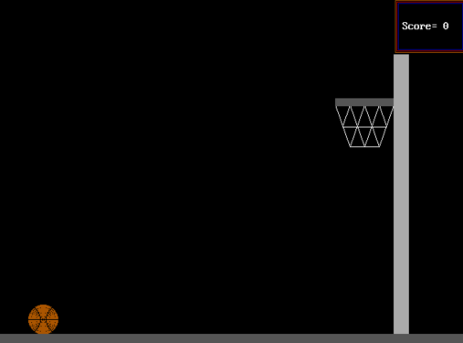

# Basketball Game

What began as three best friends tinkering with vectors in QBasic evolved into a game that showcased the game they adored at lunch. The QBasic game, like their lunchbreak games, is a single court basketball game in which the player must put the ball within the hoop to score points.

The only change is that instead of gravity and ball velocity influencing ball movement, the game allows direct influence over the basket ball by pressing computer keys. I realize that was a silly way to do it, but three ninth-grade students didn't know any better.

  

  <b>- Game play</b>

  

