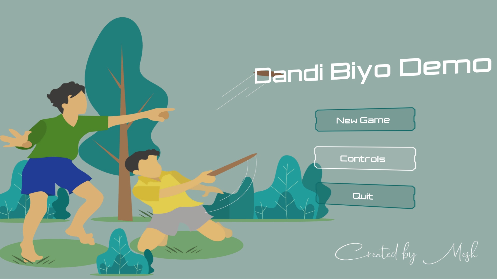

# Dandi Biyo - Demo

A demo game built using Unity Game Engine, during my high school as a reminiscence of the childhood game I used to play with my cousins.   
Despite a lot of noticeable bugs, it's still a workable demo and can be used as a reference for creating a full-fledged game later on down the line.

  

 
  <b>- Start Screen</b>

  
  
      

  <b>- Game play</b>
  
  

