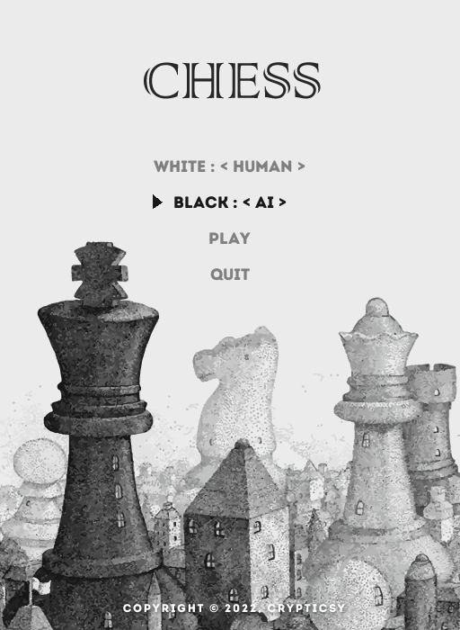
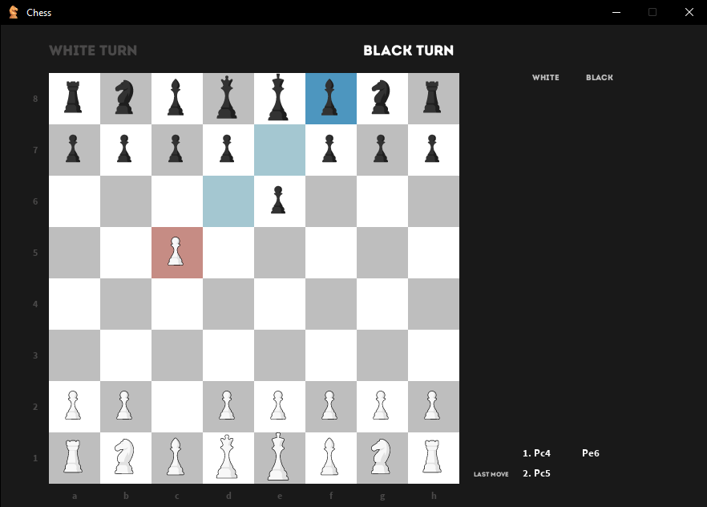

# Chess

Yes!!! Another chess engine as if there aren't enough on the Internet. And since I have played a handful of games till date with zero wins, so it was time I finally taught the computer to play it for me. (´。＿。｀) 
</br>


</br></br>

<p align="center">
    
</p>

<br/><br/>

<p align="center">
    
</p>


## Index
- [Chess](#chess)
  - [Index](#index)
  - [About](#about)
  - [Usage](#usage)
    - [Installation](#installation)
    - [Commands](#commands)

<a name="about"></a>
## About
This project includes a full chess engine, gui engine, and an AI engine. The AI engine utilizes the minimax and alpha beta pruning algorithms.

<a name="usage"></a>
## Usage
To install this project, make sure you have the correct version of Python and Pygame. 

<a name="installation"></a>
### Installation
- Switch to Python3.
- Follow the code below to create virtual environment and install the necessary libraries.
```
git clone https://github.com/crypticsy/Playground
cd ./Game_Engine/Chess/
python3 -m venv venv
source venv/bin/activate
pip install -r requirements.txt
```

<a name="commands"></a>
### Commands
- To start the game, run `python ChessMain.py`, then select the game mode you want to play in the command line.
- To undo a move, press `z`.
- To reset the board, press `r`.
