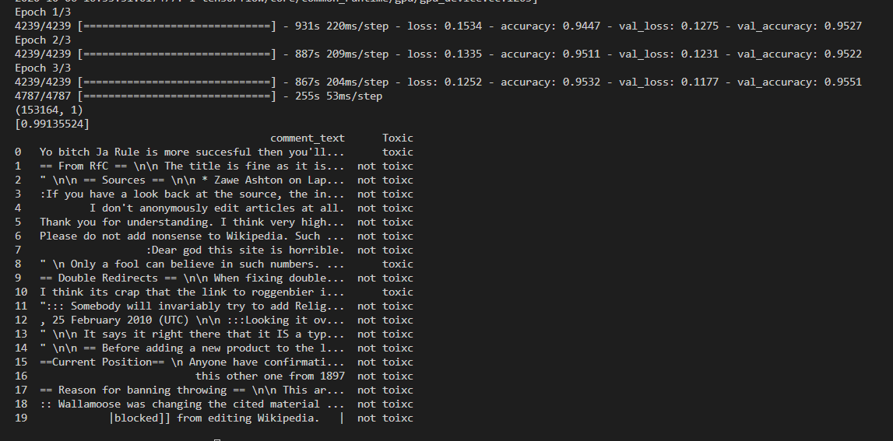

  # Toxic comments classification through 1D Convolutions with Keras

  Turns out computers can distinguish between toxic and non-toxic comments after all.

  Before executing the file, download and extract `glove.6B.100d.txt` from `https://www.kaggle.com/danielwillgeorge/glove6b100dtxt`

  You can train the model by running `toxic_comment_classification.py` and implement it in your projects.

    

  

